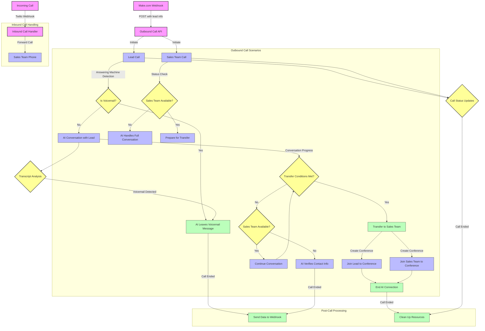

# ElevenLabs-Twilio AI Caller

This project integrates Twilio's telephony capabilities with ElevenLabs' conversational AI to create an automated phone calling system. It supports both outbound and inbound calls with features like custom prompts, lead management, and sales team handoff.

## Features
- **Outbound Calls**: Initiate AI-powered calls with customizable prompts
- **Inbound Call Handling**: Forward incoming calls to sales team
- **Authentication**: Secure ElevenLabs API integration
- **Custom Prompts**: Support for dynamic conversation prompts via make.com
- **Lead Management**: Handle lead data and context
- **Sales Team Handoff**: Seamless transfer from AI to human agents
- **WebSocket Support**: Real-time audio streaming
- **Outbound Webhooks**: Send conversation transcripts and summaries to make.com
- **Intent Detection**: Centralized system for detecting and responding to caller intents
- **Modular Architecture**: Refactored code structure for better testability and maintainability

## Prerequisites
- Node.js (v20 or higher)
- Twilio account with a phone number
- ElevenLabs account with API access
- Replit account (optional, for deployment)
- Make.com account (for automation)

## Setup Instructions

1. **Clone the Repository**
```bash
git clone <repository-url>
cd elevenlabs-twilio-ai-caller
```

2. **Install Dependencies**
```bash
npm install
```

3. **Configure Environment Variables**
Create a `.env` file in the root directory with the following:
```
ELEVENLABS_API_KEY=your_elevenlabs_api_key
ELEVENLABS_AGENT_ID=your_elevenlabs_agent_id
TWILIO_ACCOUNT_SID=your_twilio_account_sid
TWILIO_AUTH_TOKEN=your_twilio_auth_token
TWILIO_PHONE_NUMBER=+1xxxxxxxxxx
SALES_TEAM_PHONE_NUMBER=+1xxxxxxxxxx
PORT=8000
MAKE_WEBHOOK_URL=your_make_webhook_url
```

4. **Prepare Audio Files**
- Place `handoff.mp3` in the root directory for call transfers

## Code Structure

The application code is organized in a modular structure for better maintainability:

- `app.js` - Main entry point that initializes the server
- `outbound-calls.js` - Handles outbound call routing and management
- `inbound-calls.js` - Manages inbound call logic
- `forTheLegends/` - Contains modular components:
  - `outbound/call-state.js` - Manages call state with getter/setter functions
  - `outbound/conference-events.js` - Handles conference event processing
  - `outbound/elevenlabs-client.js` - ElevenLabs API client
- `test/` - Test suites for validation and regression testing

5. **Run the Application**
```bash
npm start
```

## Environment Variables
| Variable | Description | Required |
|----------|-------------|----------|
| ELEVENLABS_API_KEY | ElevenLabs API key | Yes |
| ELEVENLABS_AGENT_ID | ElevenLabs Agent ID | Yes |
| TWILIO_ACCOUNT_SID | Twilio Account SID | Yes |
| TWILIO_AUTH_TOKEN | Twilio Auth Token | Yes |
| TWILIO_PHONE_NUMBER | Twilio source phone number | Yes |
| SALES_TEAM_PHONE_NUMBER | Sales team destination number | Yes |
| PORT | Server port (default: 8000) | No |
| MAKE_WEBHOOK_URL | Make.com webhook URL | Yes |

## Usage

### Making an Outbound Call
Send a POST request to `/outbound-call-to-sales`:
```bash
curl -X POST https://your-domain.com/outbound-call-to-sales \
-H "Content-Type: application/json" \
-d '{
  "number": "+14088210387",
  "prompt": "You are Heather from First Light Home Care...",
  "leadinfo": {
    "LeadName": "John Doe",
    "CareReason": "needs help due to macular degeneration",
    "CareNeededFor": "Dorothy"
  }
}'
```

### Using with Make.com
To automate outbound calls using Make.com, follow these steps:

1. **Set Up a Mailhook**
   - Create a Mailhook in Make.com to receive email notifications containing lead information.

2. **OpenAI Transform Text to Structured Data**
   - Use an OpenAI module to parse the email text into structured data.
   - Configure the OpenAI module with the following data definitions:
     - `number`: Phone number of the point of contact (E.164 format, e.g., "+12073223372")
     - `LeadName`: Point of Contact name (text)
     - `CareReason`: Concise summary of why care is needed (text, e.g., "Needs help due to macular degeneration and is a fall risk.")
     - `CareNeededFor`: Name of the person needing care and relation (if provided, text, e.g., "Dorothy")
   - Use the gpt-4o-mini (system) model with this prompt:
     ```
     I am providing you an email about the lead information I just obtained. You need to parse the text and provide it for a sales agent to call the lead so keep that audience in mind.
     ```

3. **HTTP Make a Request Module**
   - Configure an HTTP module to send a POST request to `https://elevenlabs-twilio-ai-caller-spicywalnut.replit.app/outbound-call-to-sales`
   - Use this JSON request body:
   ```json
   {
     "prompt": "You are Heather, a friendly and warm care coordinator for First Light Home Care, a home healthcare company. You're calling to follow up on care service inquiries with a calm and reassuring voice, using natural pauses to make the conversation feel more human-like. Your main goals are: 1. Verify the details submitted in the care request from the Point of Contact below for the 'Care Needed For'. 2. Show empathy for the care situation. 3. Confirm interest in receiving care services for the 'Care Needed For'. 4. Set expectations for next steps, which are to discuss with a care specialist. Use casual, friendly language, avoiding jargon and technical terms, to make the lead feel comfortable and understood. Listen carefully and address concerns with empathy, focusing on building rapport. If asked about pricing, explain that a care specialist will discuss detailed pricing options soon. If the person is not interested, thank them for their time and end the call politely. Here is some of the key information:",
     "number": "{{3.number}}",
     "leadinfo": {
       "LeadName": "{{3.LeadName}}",
       "CareReason": "{{3.CareReason}}",
       "CareNeededFor": "{{3.CareNeededFor}}"
     }
   }
   ```
   - The dynamic variables (`{{3.number}}`, `{{3.LeadName}}`, `{{3.CareReason}}`, `{{3.CareNeededFor}}`) pull data from the OpenAI module's output.

### Configuring ElevenLabs Conversational AI
To set up and obtain the necessary configurations for ElevenLabs Conversational AI:

1. **Create an ElevenLabs Account**
   - Sign up at [ElevenLabs.io](https://elevenlabs.io) if you don't already have an account.

2. **Obtain API Key**
   - Log in to your ElevenLabs dashboard.
   - Navigate to the "API" or "Profile" section.
   - Generate an API key. This is your `ELEVENLABS_API_KEY`. Keep it secure and do not share it publicly.

3. **Create and Configure an Agent**
   - Go to the "Conversational AI" section in the ElevenLabs dashboard.
   - Create a new agent for your use case (e.g., a care coordinator like Heather).
   - Configure the agent with:
     - **Voice**: Select a voice that matches your desired tone (e.g., friendly and warm).
     - **Prompt**: Define the initial prompt for the agent, such as:
       ```
       You are Heather, a friendly and warm care coordinator for First Light Home Care, a home healthcare company. You're calling to follow up on care service inquiries with a calm and reassuring voice, using natural pauses to make the conversation feel more human-like. Your main goals are: 1. Verify the details submitted in the care request from the Point of Contact below for the 'Care Needed For'. 2. Show empathy for the care situation. 3. Confirm interest in receiving care services for the 'Care Needed For'. 4. Set expectations for next steps, which are to discuss with a care specialist. Use casual, friendly language, avoiding jargon and technical terms, to make the lead feel comfortable and understood. Listen carefully and address concerns with empathy, focusing on building rapport. If asked about pricing, explain that a care specialist will discuss detailed pricing options soon. If the person is not interested, thank them for their time and end the call politely.
       ```
     - **First Message**: Set an initial greeting, e.g., "Hi, is this [LeadName]? This is Heather from First Light Home Care. I understand you're looking for care for [CareNeededFor]. Is that correct?"
   - Save the agent to generate an `ELEVENLABS_AGENT_ID`. This ID is used to identify your agent in API requests.

4. **Test the Agent**
   - Use the ElevenLabs API playground or make test API calls to ensure the agent responds as expected.
   - Refer to the ElevenLabs documentation for detailed API endpoints and parameters: [ElevenLabs API Docs](https://elevenlabs.io/docs).

### Inbound Calls
Configure your Twilio number to handle incoming calls using a webhook:
- In the Twilio Console, set the voice webhook URL to `https://elevenlabs-twilio-ai-caller-spicywalnut.replit.app/incoming-call`
- This will forward incoming calls to the specified `SALES_TEAM_PHONE_NUMBER` as configured in your environment variables.

## Project Structure
```
/elevenlabs-twilio-ai-caller
├── forTheLegends/outbound/
│   ├── outbound-authenticated.js    # Authenticated calls
│   ├── outbound-custom-make.js     # Custom prompts from make.com
│   ├── outbound-normal.js          # Basic unauthenticated calls
│   ├── outbound.custom-prompt.js   # Flexible prompt handling
│   ├── intent-constants.js         # Centralized intent categories and patterns
│   ├── intent-detector.js          # Intent detection and processing logic
│   └── webhook-config.js           # Centralized webhook configuration
├── forTheLegends/prompts/
│   └── elevenlabs-prompts.js       # Centralized prompts and configurations
├── inbound-calls.js                # Inbound call routing
├── outbound-calls.js               # Main outbound call logic
├── index.js                        # Server entry point
├── handoff.mp3                     # Audio for call transfers
├── makePayload.txt                 # Sample make.com payload
├── package.json                    # Dependencies
├── .replit                         # Replit configuration
└── replit.nix                      # Nix environment config
```

## System Architecture and Dataflow

The following diagram illustrates the various dataflow scenarios and decision points in the ElevenLabs-Twilio AI caller system:



### Dataflow Scenarios Explained

1. **Outbound Call Initiation**
   - System receives lead information from Make.com webhook
   - Two parallel calls are initiated: one to the lead and one to the sales team
   - Answering Machine Detection (AMD) determines if the lead call reached a human or voicemail

2. **Voicemail Handling**
   - If AMD detects a voicemail, the AI is instructed to leave an appropriate message
   - The sales team is notified if they're already on the line
   - Call data and transcripts are sent to a webhook for follow-up

3. **Human Conversation Flow**
   - When a human answers, the AI engages in conversation based on the provided prompt
   - The system continuously analyzes transcripts for potential voicemail indicators
   - If detected mid-call, the system switches to voicemail handling mode

4. **Sales Team Availability**
   - If the sales team doesn't answer their call, the AI handles the entire conversation
   - The AI verifies contact information and sets expectations for follow-up
   - Call data is sent to a webhook for the sales team to review later

5. **Call Transfer Process**
   - When both the lead and sales team are on their calls, a conference is created
   - Both parties are joined to the conference
   - The AI connection is terminated, and the handoff audio is played
   - The sales team takes over the conversation

6. **Inbound Call Handling**
   - Incoming calls to the Twilio number are automatically forwarded to the sales team
   - No AI interaction occurs for inbound calls

7. **Post-Call Processing**
   - After calls end, relevant data (transcripts, summaries) is collected
   - Data is sent to a webhook for integration with CRM systems
   - Call resources are cleaned up

8. **Intent Detection Flow**
   - During conversations, the system continuously analyzes lead transcripts for intent patterns
   - The centralized intent detection system identifies intents such as:
     - Needs immediate care
     - Scheduling callback requests
     - Showing interest or disinterest
     - Cannot talk now
     - Already has care
   - When intents are detected, the AI receives specific instructions on how to respond
   - High-priority intents (like "needs immediate care") can trigger immediate actions
   - Multiple intent tracking allows for nuanced conversation understanding
   - Intent data is included in webhook payloads for CRM integration

## Troubleshooting
- **Call fails to initiate**: Check Twilio credentials and phone numbers
- **No audio**: Verify ElevenLabs API key and agent ID
- **WebSocket errors**: Ensure server is accessible and port is open
- **Logs**: Check server logs for detailed error messages

## Testing
This project includes a comprehensive test suite to ensure all components function correctly.

### Quick Start
```bash
# Install dependencies
npm install

# Run all tests
npm test

# Run specific tests
npm test -- test/unit/inbound-calls.test.js

# Run tests with coverage information
npm run test:coverage

# Run tests in watch mode during development
npm run test:watch
```

### Test Types
- **Unit Tests**: Individual component tests
- **Integration Tests**: Tests that verify components work together
- **Mocks**: Mock implementations of external services like Twilio and ElevenLabs

For detailed information on testing, see the [Testing Guide](test/README.md).

## Contributing
1. Fork the repository
2. Create a feature branch (`git checkout -b feature/amazing-feature`)
3. Commit your changes (`git commit -m 'Add amazing feature'`)
4. Push to the branch (`git push origin feature/amazing-feature`)
5. Open a Pull Request

## Outbound Webhook Integration

The system sends conversation data to make.com after each ElevenLabs AI interaction. This allows for:

1. Capturing full conversation transcripts and AI-generated summaries
2. Tracking scheduling preferences expressed by leads
3. Monitoring agent performance and conversation quality
4. Improving lead follow-up processes

### Webhook Payload

The webhook sends a comprehensive payload containing:

- Call information (Twilio SID, ElevenLabs conversation ID)
- Lead data
- Conversation transcript
- AI-generated summary
- Callback preferences (if detected)
- Success criteria and data collection from ElevenLabs

### Configuration

Configure the webhook URL in your `.env` file:

```
MAKE_WEBHOOK_URL=https://hook.us2.make.com/your-endpoint-here
```

You can also configure webhook behavior programmatically:

```javascript
import { configureWebhook } from './forTheLegends/outbound/index.js';

configureWebhook({
  url: 'https://your-custom-webhook-url.com',
  retryAttempts: 5,
  retryDelayMs: 2000,
  timeoutMs: 15000,
  enabled: true
});
```

## Code Centralization

The system has been designed with a focus on maintainability through centralization of key components:

1. **Prompt Management**
   - All ElevenLabs prompts are centralized in `forTheLegends/prompts/elevenlabs-prompts.js`
   - Dynamic variable interpolation for personalized conversations
   - Supports both standard calls and voicemail scenarios

2. **Webhook Configuration**
   - Make.com webhook URLs are managed in `forTheLegends/outbound/webhook-config.js`
   - Context-aware webhooks (main, callback, voicemail)
   - Configurable retry and timeout settings

3. **Intent Detection**
   - Intent patterns and categories are defined in `forTheLegends/outbound/intent-constants.js`
   - Organized by intent type with priority levels and instruction sets
   - Supported by comprehensive processing logic in `intent-detector.js`
   - Extensible design for adding new intent types

This centralization approach improves:
- Code maintainability and readability
- Testing and validation
- Ease of updates and extensions
- Configuration management across environments
